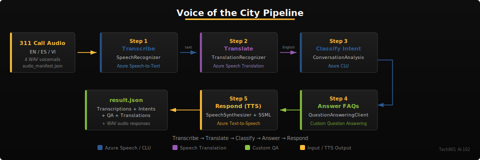

# Activity 6 — Voice of the City

Citizens call the Memphis 311 line to report potholes, check on service requests, and ask questions about city services — sometimes in English, sometimes in Spanish or Vietnamese. In this activity, you build the **voice and language understanding layer** that processes those calls: transcribe voicemails, translate multilingual audio, classify caller intent, answer FAQs, and synthesize spoken responses.



## Learning Objectives

By the end of this activity, you will be able to:

1. **Transcribe** audio files using Azure Speech-to-Text (`SpeechRecognizer`)
2. **Translate** multilingual speech using Azure Speech Translation (`TranslationRecognizer`)
3. **Classify** caller intent using Conversational Language Understanding (CLU)
4. **Answer** citizen FAQs using Custom Question Answering
5. **Synthesize** voice responses using Text-to-Speech and SSML
6. **Explain** the CLU model lifecycle: define → train → deploy → consume

> [!IMPORTANT]
> **AI-102 Exam Connection**
> This activity covers **Domain 5.2** (Speech Services) and **Domain 5.3** (CLU lifecycle + Question Answering). Expect exam questions on SpeechConfig vs. AudioConfig, SSML elements, CLU training data requirements, and QA confidence thresholds.

## Prerequisites

- Completed Activity 5 (Constituent Services Hub)
- Environment variables configured (see `.env.example`)
- Python 3.11+ with dependencies installed

### Setup

1. Copy `.env.example` to `.env` and fill in your credentials
2. Install dependencies:
   ```bash
   pip install -r requirements.txt
   ```
3. Generate sample audio files (requires Speech credentials):
   ```bash
   python data/generate_audio.py
   ```
   This creates WAV files in `data/audio/` using Azure TTS.

> [!WARNING]
> The Speech SDK requires GStreamer on Linux. In Codespaces, the devcontainer installs this automatically. If running locally on Linux, install: `sudo apt-get install libgstreamer1.0-0 gstreamer1.0-plugins-base gstreamer1.0-plugins-good`

## Step 1: Transcribe 311 Calls

Open `app/speech.py` and implement `transcribe_audio()`.

A citizen leaves a voicemail about a pothole. Your code needs to turn that audio into text using Azure Speech-to-Text.

**What to implement:**
- Create an `AudioConfig` from the WAV file path
- Create a `SpeechRecognizer` with the speech config and audio config
- Call `recognize_once()` for single-utterance recognition
- Check `result.reason == ResultReason.RecognizedSpeech`
- Return the transcription text, confidence score, and duration

```python
# Key SDK pattern:
audio_config = speechsdk.AudioConfig(filename=audio_path)
recognizer = speechsdk.SpeechRecognizer(speech_config=config, audio_config=audio_config)
result = recognizer.recognize_once()
```

> [!NOTE]
> **Self-Check** (10 points)
> ```bash
> pytest tests/test_basic.py::TestModuleImports::test_import_speech -v
> ```

> [!NOTE]
> **Self-Check** (10 points)
> ```bash
> pytest tests/test_basic.py::TestTranscription -v
> ```

## Step 2: Translate Multilingual Calls

Implement `translate_speech()` in `app/speech.py`.

Memphis has a growing multilingual population. When a caller speaks Spanish or Vietnamese, the system must translate their message to English for processing.

**What to implement:**
- Use `SpeechTranslationConfig` with target languages
- Create a `TranslationRecognizer`
- Call `recognize_once()` and extract translations from `result.translations`
- Return source language and translation dictionary

> [!IMPORTANT]
> **Speech Translation vs. Text Translation**
> Speech Translation (`TranslationRecognizer`) translates audio directly — no intermediate text step. This is different from the Text Translation API you used in Activity 5, which translates already-transcribed text. The exam tests your understanding of when to use each approach.

> [!NOTE]
> **Self-Check** (10 points)
> ```bash
> pytest tests/test_basic.py::TestTranslation -v
> ```

> [!NOTE]
> **Self-Check** (10 points)
> ```bash
> pytest tests/test_basic.py::TestModuleImports::test_import_main -v
> ```

## Step 3: Classify Intent with CLU

Implement `classify_intent()` in `app/clu.py`.

Once a call is transcribed, the system needs to understand what the caller wants. Is this a **new issue report**, a **status check**, or an **information request**? A pre-trained CLU model classifies intent and extracts entities like locations and case numbers.

**What to implement:**
- Check if `CLU_PROJECT_NAME` and `CLU_DEPLOYMENT_NAME` are set
- If not configured, use `_keyword_classify()` as fallback
- If configured, call `ConversationAnalysisClient.analyze_conversation()`
- Extract the top intent, confidence, and entities from the response

> [!NOTE]
> **CLU Lifecycle (AI-102 Exam Topic D5.3)**
>
> | Phase | What happens |
> |-------|-------------|
> | **Define** | Create intents (`ReportIssue`, `CheckStatus`, `GetInformation`), entities (`Location`, `IssueType`, `CaseNumber`), and label utterances |
> | **Train** | Build the language model from labeled data |
> | **Evaluate** | Review precision/recall per intent, add more utterances where weak |
> | **Deploy** | Publish to a named deployment slot (e.g., `production`) |
> | **Consume** | Call the runtime API with `analyze_conversation()` |

The keyword fallback in `_keyword_classify()` works for local development, but the live CLU model provides much higher accuracy and entity extraction.

> [!NOTE]
> **Self-Check** (10 points)
> ```bash
> pytest tests/test_basic.py::TestIntentClassification -v
> ```

> [!NOTE]
> **Self-Check** (10 points)
> ```bash
> pytest tests/test_basic.py::TestIntentClassification::test_intent_has_entities -v
> ```

## Step 4: Answer Citizen FAQs

Implement `answer_question()` in `app/question_answering.py`.

Citizens frequently ask: *"When is my trash pickup day?"* or *"How do I check my case status?"* A Custom Question Answering knowledge base answers these automatically.

**What to implement:**
- Check if `QA_PROJECT_NAME` and `QA_DEPLOYMENT_NAME` are set
- If not configured, use `_fallback_answer()` as fallback
- If configured, call `QuestionAnsweringClient.get_answers()`
- Extract the top answer, confidence, source, and follow-up prompts

> [!IMPORTANT]
> **Custom QA vs. RAG**
> Custom Question Answering uses a curated FAQ knowledge base — great for well-known questions with definitive answers. RAG (Activity 7) retrieves from unstructured documents — better for open-ended questions. The exam tests when to use each pattern.

> [!NOTE]
> **Self-Check** (10 points)
> ```bash
> pytest tests/test_basic.py::TestQuestionAnswering -v
> ```

> [!NOTE]
> **Self-Check** (10 points)
> ```bash
> pytest tests/test_basic.py::TestQuestionAnswering::test_qa_has_answers -v
> ```

## Step 5: Synthesize Voice Responses

Implement `synthesize_response()`, `build_ssml()`, and `synthesize_ssml()` in `app/speech.py`.

After processing a call, the system confirms the action with a spoken response. Plain text TTS works, but SSML gives you control over pronunciation, pacing, and emphasis — critical for reading case numbers and dates correctly.

**What to implement:**

**Plain text TTS** (`synthesize_response`):
- Set the voice name on the speech config
- Create `AudioConfig` for WAV output
- Call `speak_text_async(text).get()`

**SSML builder** (`build_ssml`):
- Build a valid SSML document with `<speak>`, `<voice>`, `<prosody>`
- Include at least one `<break>` for natural pauses
- Include at least one `<say-as>` for case numbers or dates

**SSML synthesis** (`synthesize_ssml`):
- Call `speak_ssml_async(ssml).get()` instead of `speak_text_async`

```xml
<!-- Example SSML structure -->
<speak version="1.0" xmlns="http://www.w3.org/2001/10/synthesis" xml:lang="en-US">
  <voice name="en-US-JennyNeural">
    <prosody rate="medium" pitch="default">
      Your case number is <say-as interpret-as="digits">3114567</say-as>.
      <break time="500ms"/>
      You will receive an update within 48 hours.
    </prosody>
  </voice>
</speak>
```

> [!IMPORTANT]
> **SSML Elements (AI-102 Exam)**
> Know these SSML elements: `<speak>` (root), `<voice>` (neural voice selection), `<prosody>` (rate, pitch, volume), `<break>` (pauses), `<say-as>` (pronunciation hints for digits, dates, addresses), `<phoneme>` (IPA pronunciation).

> [!NOTE]
> **Self-Check** (10 points)
> ```bash
> pytest tests/test_basic.py::TestSpeechResponse -v
> ```

> [!NOTE]
> **Self-Check** (10 points)
> ```bash
> pytest tests/test_basic.py::TestSpeechResponse::test_has_ssml_response -v
> ```

## Run the Full Pipeline

Once all steps are implemented, run the complete pipeline:

```bash
python -m app.main
```

This processes all audio files through the 5-step pipeline and saves results to `result.json`.

> [!NOTE]
> **Self-Check** (10 points)
> ```bash
> pytest tests/test_basic.py::TestOutputContract -v
> ```

## Troubleshooting

| Error | Cause | Fix |
|-------|-------|-----|
| `SPXERR_AUDIO_SYS_LIBRARY_NOT_FOUND` | GStreamer not installed (Linux) | Run `sudo apt-get install libgstreamer1.0-0 gstreamer1.0-plugins-base gstreamer1.0-plugins-good` |
| `401 Unauthorized` (Speech) | Wrong key or region | Verify `AZURE_SPEECH_KEY` and `AZURE_SPEECH_REGION` match your resource |
| `No audio files found` | Haven't generated samples | Run `python data/generate_audio.py` |
| `ResultReason.NoMatch` | Audio too short or silent | Check WAV file is valid; try re-generating with `generate_audio.py` |
| `404 Not Found` (CLU) | Wrong project or deployment | Verify `CLU_PROJECT_NAME` and `CLU_DEPLOYMENT_NAME` in `.env` |
| `404 Not Found` (QA) | Wrong project or deployment | Verify `QA_PROJECT_NAME` and `QA_DEPLOYMENT_NAME` in `.env` |

## Submission

Commit and push your completed code:

```bash
git add -A
git commit -m "Complete Activity 6 — Voice of the City"
git push
```

Hidden tests run automatically via GitHub Actions. Check the Actions tab for your autograding score.

> [!TIP]
> **Stretch Goal**
> Extend the pipeline to handle continuous recognition (`start_continuous_recognition()`) instead of single-utterance. This is more realistic for longer voicemails but requires event-driven callbacks. See the [Azure Speech SDK documentation](https://learn.microsoft.com/azure/ai-services/speech-service/get-started-speech-to-text) for examples.
